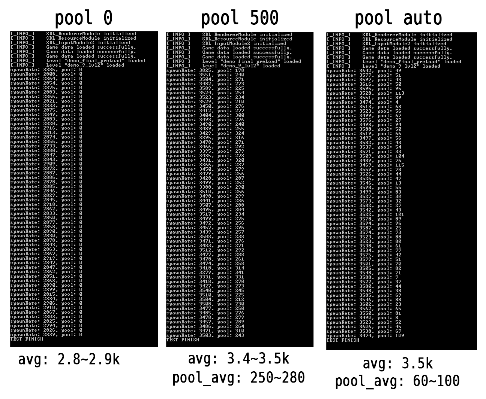

# 2D-game-engine
Game engine made in C++ with SDL2.

# WARNING - PLEASE READ:

## **This is a work in progress. PLEASE watch the [VIDEO](https://youtu.be/ljVjTXEBvMw) about the project if you want to know what it looks like and what you can and can't do with it.**

## You can also check the original video I made a while back on Windows [here](https://www.youtube.com/watch?v=3SOYCM9kgbw). **I originally made this project on Windows, for Windows. This project is just me messing around with the code I wrote back then, trying to make it work on Linux.**

## To get this running on Linux:
- Install a c++ compiler, we are using gcc
    - `sudo dnf install gcc-c++`
- Install cmake (Im using CMake because this way I don't have to input all the .cpp files in the correct order for compilation to work)
    - `sudo dnf install cmake`
- Install SDL2 development libraries (we will be using SDL2, mixer, ttf and image)
    - `sudo dnf install SDL2-devel SDL2_mixer-devel SDL2_ttf-devel SDL2_image-devel`
    - If for some reason your SDL libraries are not located at `/usr/include/SDL2`, please update the `includePath` property inside **c_cpp_properties.json**  and also the `include_directories` inside the CMakeLists.txt with the correct path.
- Create a build directory inside the project directory
    - `mkdir build`
- Run the cmake command **inside the build directory you just created**. This  will generate CMake files using the CMakeLists.txt on the parent directory.
    - `cd build`
    - `cmake ..`
- Go inside the build folder and run the make command
    - `make`
- Copy the Resources directory inside the build folder.
    - If you are on the root directory:
        - `cp -rf Resources build`
- Inside the build directory, run the application by executing this command:
    - `./app`

# About this project
This was a huge project I did a while ago for a fundamentals of game engines class. I decided to implement all that crossed my mind and ended up building this cool little 2D/2.5D game engine.

I initially made it on Windows using Visual Studio, so making it work on Linux with VSCode + gcc has been a really fun journey. This is the first compiled application I make work on Linux and it has been a great intro snippet on things like CMake, how libraries work on Linux (no .dlls) and path differences between Linux and Windows.

## Structure of the Engine:
The Engine is divided into different building pieces (explained below) and it is decoupled from the SDL library via interfaces.

## Modules:
Modules are major parts of the Engine.These are the InputModule, RendererModule and ResourceModule.
All these modules are interfaces that define how the module implementation should be. I implement all these module interfaces with classes that use the SDL library. The Engine only uses the interfaces.
‍
The InputModule manages input.
The RenderModule manages rendering.
The ResourceModule manages files.

## Managers:
There are several managers. They often make use of the Module's interfaces to get what they need.

The managers are:
ColliderManager, EntityManager, EventSystem, GameManager, LevelManager, SaveManager, ShapeManager, SoundManager, SpriteManager, TextManager.
‍
All these manage what they are incharge of and provide tool functions related to that.

## Core:
The core is where everything gets glued together, where the game loop lives.
The core also holds the modules and the managers and uses them.

## ACS (Actor Component System):
In order to manage game objects and components I use what I think a bare bones ACS would do.
I have objects (actors) that I refer to as Entities and I fill them with Components. I then have the EntityManager that holds references to the entities and manage them.
‍
The EntityManager updates the entities and the entities update the Components. Components hold data and useful functions related to that data.

## Components:
I have two kind of component types: Engine Components and User Components.

- Engine Components:
    - These are components that are meant to come with the project by default. They are general purpose components: EC_Animator, EC_Button, EC_Collider, EC_ParticleSpawner, EC_Shape, EC_Sound, EC_Sprite, EC_Text and EC_Transform.
- User Components:
    - These are meant to be created by whoever is using the project, they are meant to be project specific.
They are the counter-part of Unity's scripts.

## Order of execution:
Program starts:
- Initialize modules
- Load Level
‍
While(running):
- Update Input
    - Get delta
    - Update Entities (update, delete, add; these three happen separately and in that order)
    - Update Colliders (this does not happen every frame, you can update this at its own rate)
    - Should we quit? (If true then we exit this loop)
    - Run trough events (You can add events to this event system as you go and at the end of the update the program goes trough all of them and solves them one by one. There is also another event system where the events get solved instantly)
- Render
    - Draw Sprites (draws all the sprites)
    - Draw Objects (draws any basic shapes like lines and rectangles on top of the sprites)
    - Draw Text
    - Draw Shapes (draws any shape; a shape is a quad or a collection of quads. You can see this in the demos.The gun is a shape)

Program quit:
- De-Init anything that needs de-initialization.

## Feature List:
- Particles have their own, automatically managed pool.
- You can tweak particle systems to use basic shapes or sprites, one or various source particles, and more.
- Resource files are automatically managed: You don't have to worry about not loading a file more than once or deleting it after used.
- Visual collider/trigger debugger: You can draw them on screen to get a better idea of whats going on and see which state they are in.
- Simple console Logging system that tells you about errors or warnings and let you filter them or add your own message logs.
- Sprites use layers.
- Supports a a basic way of loading and managing more than one level. For example the pause menu you see in the video is its own level, loaded on top of the current level. Whenever we show it we load it and when we close it we unload it.
- There is a loading screen (just an image, no loading bar)
- Since you can change the delta time, you can create a pause menu.
- There are two event systems, one that runs at the end of update and one that triggers the event instantly.
- Basic save/load support.
- Several other features that escape me, mostly component level features that help you use the components in various ways (scaling, looping animations, animation clips, etc...)

## About the particle pool:
Here you can see a test I made to check how the pool in the particle system behaved in various settings.
- Column 1 is set up to not use a pool, so particle entities are always instantiated when needed.
- Column 2 is set to have a pool of up to 500 particles
- Column 3 is set to let the engine manage the pool
I am spawning as many particles as I can every frame.
